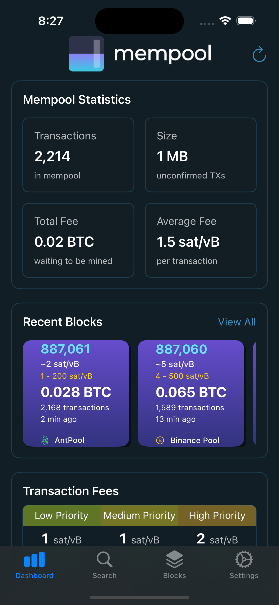
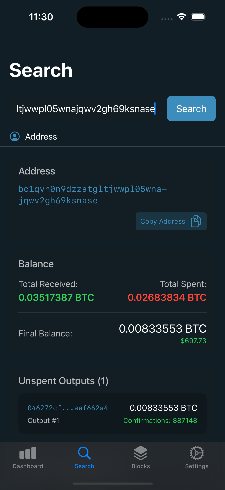
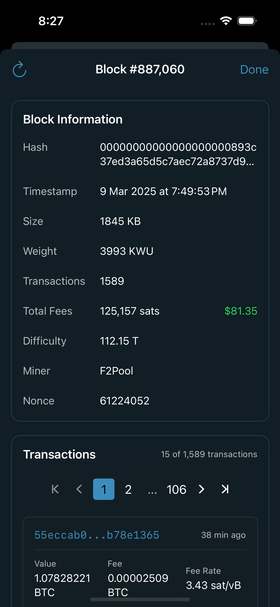
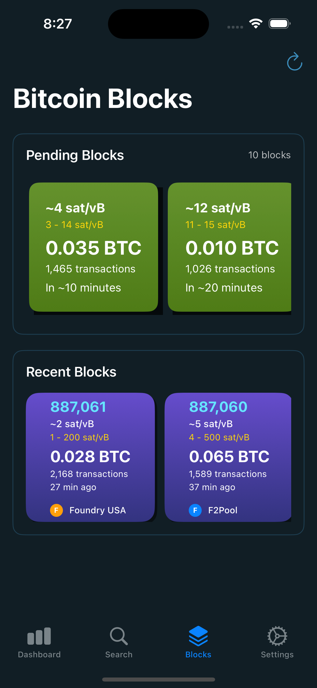

# Bitcoin Mempool Explorer

A comprehensive iOS application for monitoring Bitcoin network activity in real-time. This app brings the functionality of mempool.space to your iPhone, allowing you to explore the Bitcoin mempool, track transactions, analyze blocks, and monitor network fees on the go.

<p align="center">
    
    
    
    
    </p>

## Features

### Dashboard
- Real-time mempool statistics
- Transaction count and size visualization
- Fee estimation with USD conversion
- Block mining visualization
- Network difficulty and hashrate monitoring

### Block Explorer
- View recently mined blocks
- Detailed block information (size, weight, transactions)
- Pending block visualization with estimated mining times
- Fee rates and ranges for each block

### Mempool Visualization
- Visual representation of mempool transactions
- Color-coded by fee rate
- Size-coded by transaction weight
- Interactive transaction details
- Fee rate filtering options

### Transaction Search
- Search by transaction ID (txid)
- View inputs and outputs
- Fee details and confirmation status
- Raw transaction data access

### Address Explorer
- Search Bitcoin addresses
- Balance information with USD conversion
- Transaction history
- UTXO (Unspent Transaction Output) details

### Settings
- Multiple Bitcoin networks (Mainnet, Testnet, Signet)
- Custom API endpoint configuration
- Adjustable auto-refresh intervals
- Cache duration settings
- Push notification preferences
- Dark mode support

## Technical Details

### Architecture
- Built with Swift and SwiftUI
- MVVM (Model-View-ViewModel) architecture
- Combines Reactive Programming for data updates
- Custom UI components for Bitcoin-specific visualizations

### Core Components
- `MempoolAPIClient`: Handles all API communication with mempool.space
- `BlockchainStateManager`: Maintains current blockchain status
- `RefreshManager`: Controls data refresh cycles
- `CacheManager`: Handles local data caching
- `NotificationsManager`: Manages push notifications

## Installation

### Requirements
- iOS 15.0 or later
- Xcode 13.0 or later
- Swift 5.5 or later

### Building from Source
1. Clone the repository:
```bash
git clone https://github.com/yourusername/bitcoin-mempool-explorer.git
```

2. Open the project in Xcode:
```bash
cd bitcoin-mempool-explorer
open BitcoinMempool.xcodeproj
```

3. Select your development team and target device

4. Build and run the application

## Privacy & Permissions

The app requires the following permissions:
- Network access to retrieve blockchain data
- Notification permissions for block alerts and fee updates

No personal data is collected or stored beyond local caching of blockchain data.

## Data Sources

This app uses the mempool.space API by default but can be configured to use other compatible Bitcoin blockchain explorers.

## Contributing

Contributions are welcome! Here's how you can help:

1. Report bugs or suggest features by opening an issue
2. Improve documentation
3. Submit a pull request with bug fixes or new features

Please read the [Contributing Guidelines](CONTRIBUTING.md) before submitting a PR.


## License

This project is licensed under the MIT License - see the [LICENSE](LICENSE) file for details.

## Acknowledgments

- [mempool.space](https://mempool.space) for their excellent Bitcoin explorer and API
- The Bitcoin community for continued inspiration and support

## Contact

If you have any questions or feedback, please open an issue on GitHub or reach out to [your-email@example.com](mailto:your-email@example.com).

---

Made with ❤️ for the Bitcoin community
